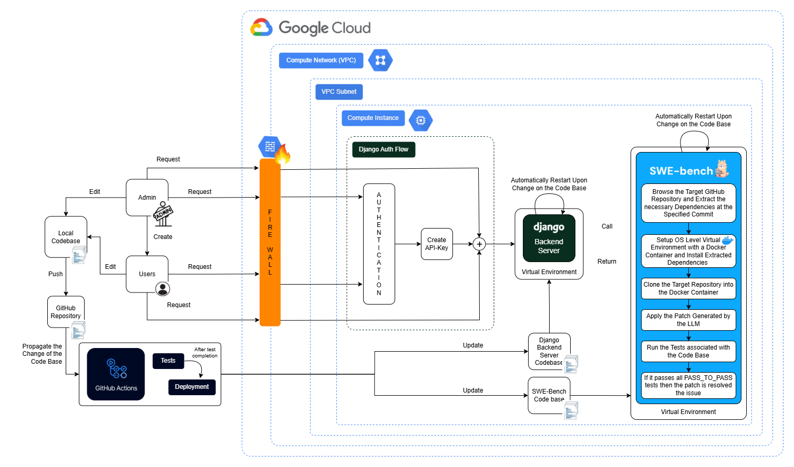

# Django-Web-App-for-SweBench-Evaluation

## Description

- This is a private API to evaluate our final year project LLM-based GitHub issue solver, with SWEBench.

- Fully automated pipeline to propagate code changes to the Django server running on Google Cloud VM.

- Contains authenticated + authorized endpoints, such that only our team can access the resources.

## Architecture Diagram

